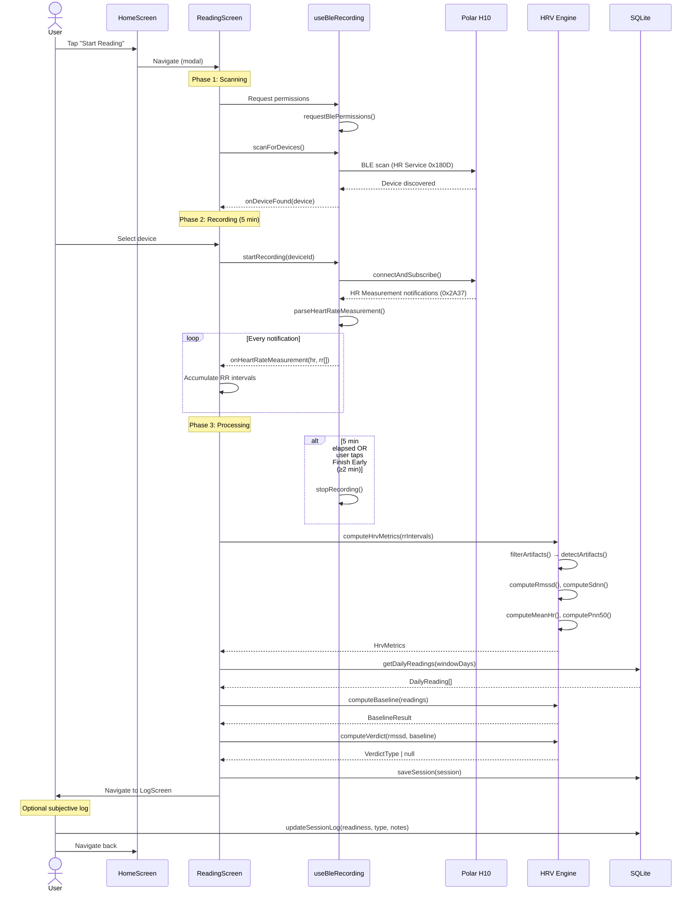
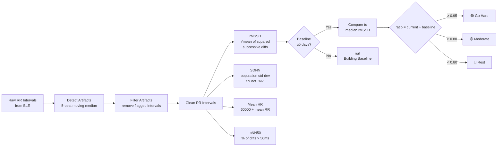
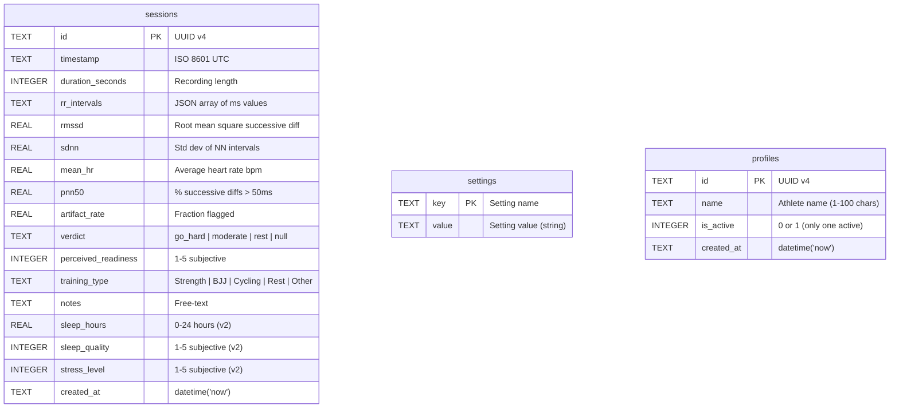
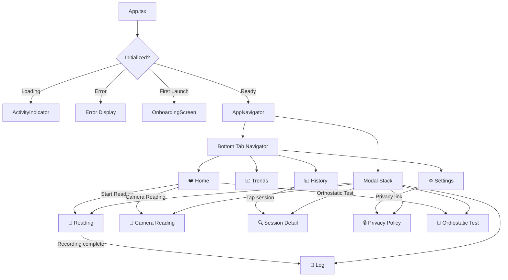
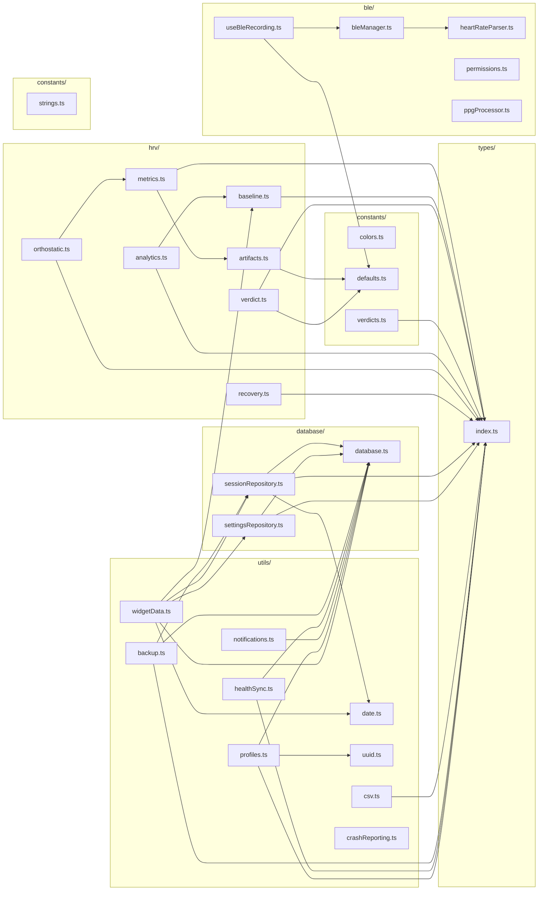
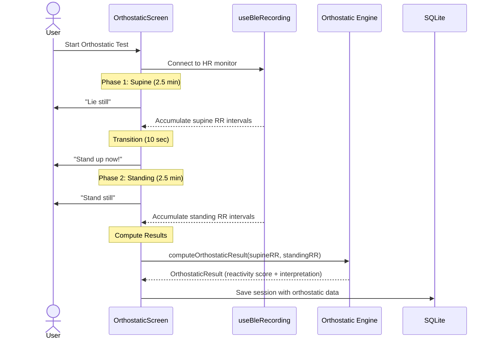
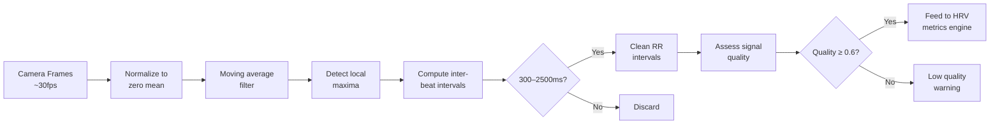
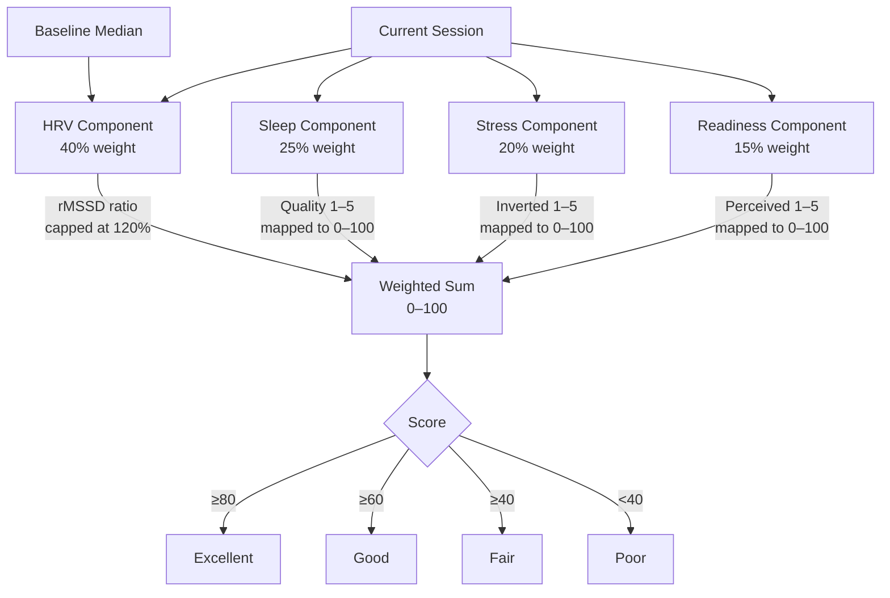

# Architecture Overview

This document describes the architecture, data flow, and key design decisions of the HRV Morning Readiness Dashboard.

## System Overview

The app follows a layered architecture with clear separation between BLE communication, HRV computation, data persistence, and presentation.

```mermaid
graph TB
    subgraph Presentation["Presentation Layer"]
        Home[HomeScreen]
        Reading[ReadingScreen]
        History[HistoryScreen]
        Log[LogScreen]
        Settings[SettingsScreen]
        Detail[SessionDetailScreen]
        Onboarding[OnboardingScreen]
        Privacy[PrivacyPolicyScreen]
        Trends[TrendsScreen]
        Coherence[CoherenceScreen]
        Import[ImportScreen]
        Plugins_UI[PluginsScreen]
        ProfilesUI[ProfilesScreen]
        Protocol[MorningProtocolScreen]
        SyncUI[SyncSettingsScreen]
        ShareUI[ShareCoachScreen]
    end

    subgraph Components["UI Components"]
        Verdict[VerdictDisplay]
        Sparkline[Sparkline]
        StatCard[StatCard]
        RRPlot[RRPlot]
        Timer[CountdownTimer]
        Slider[ReadinessSlider]
        ErrorBound[ErrorBoundary]
        WorkoutCard[WorkoutCard]
        ConnPill[ConnectionPill]
        Toast[Toast]
    end

    subgraph Navigation["Navigation"]
        AppNav[AppNavigator]
        Tabs[Bottom Tabs]
        Stack[Modal Stack]
    end

    subgraph Domain["Domain Layer"]
        Metrics[HRV Metrics]
        Artifacts[Artifact Detection]
        Baseline[Baseline Computation]
        VerdictLogic[Verdict Logic]
        Analytics[Analytics & Trends]
        Recovery[Recovery Score]
        Orthostatic[Orthostatic Test]
        Spectral[Spectral Analysis]
        Prediction[Trend Prediction]
        Coach[Coach Narrative]
        TSB[Training Stress Balance]
        Norms[Population Norms]
        ANS[ANS Balance]
        Circadian[Circadian Analysis]
        SleepArch[Sleep Architecture]
        Adaptive[Adaptive Thresholds]
    end

    subgraph BLE["BLE Layer"]
        BleManager[BLE Manager]
        Parser[HR Parser]
        Permissions[Permissions]
        Hook[useBleRecording]
        PPG[PPG Processor]
        DevProfiles[Device Profiles]
    end

    subgraph Data["Data Layer"]
        DB[SQLite Database]
        SessionRepo[Session Repository]
        SettingsRepo[Settings Repository]
    end

    subgraph Integrations["Integrations"]
        HealthSync[Health Sync]
        SleepPull[Sleep Auto-Pull]
        TwoWay[Two-Way Health Sync]
        SleepStrain[Sleep-Strain Fusion]
        ImportWizard[CSV Import Wizard]
    end

    subgraph Plugins["Plugin System"]
        PluginHost[Plugin Host]
        Marketplace[Marketplace]
        RefPlugins[Reference Plugins]
    end

    subgraph Utils["Utilities"]
        Backup[Encrypted Backup]
        Notifs[Notifications]
        Profiles[Profiles]
        Widget[Widget Data]
        CSV[CSV Export]
        Reports[Report Generator]
        ShareCard[Share Cards]
    end

    subgraph Hooks["Custom Hooks"]
        MorningProtocol[Morning Protocol]
        ReadingFlow[Reading Flow]
        SessionPersist[Session Persistence]
    end

    subgraph External["External"]
        PolarH10[Polar H10 / HR Monitor]
        Camera[Device Camera]
        HealthKit[HealthKit / Health Connect]
        Strava[Strava / TrainingPeaks]
    end

    Home --> Verdict & Sparkline & StatCard
    Reading --> Hook & Timer & RRPlot
    History --> Sparkline & Detail
    Log --> Slider & Verdict

    Hook --> BleManager --> Parser
    BleManager --> PolarH10
    BleManager --> DevProfiles
    Hook --> Permissions
    PPG --> Camera

    Reading -->|Save session| SessionRepo
    Home -->|Load today| SessionRepo
    Home -->|Load baseline| SessionRepo
    History -->|Load all| SessionRepo
    Settings --> SettingsRepo

    SessionRepo --> DB
    SettingsRepo --> DB

    Home -->|Compute| Baseline --> VerdictLogic
    Home -->|Adaptive| Adaptive --> VerdictLogic
    Home -->|Recovery| Recovery
    Home -->|Coach brief| Coach
    Home -->|Prediction| Prediction
    Reading -->|Compute| Metrics --> Artifacts
    Reading -->|Spectral| Spectral
    Home -->|Trends| Analytics
    Home -->|ANS| ANS --> Spectral
    Home -->|TSB| TSB
    Home -->|Norms| Norms
    Home -->|Circadian| Circadian

    Settings -->|Backup| Backup --> DB
    Settings -->|Health| TwoWay --> HealthKit
    TwoWay --> SleepPull
    SleepPull --> SleepStrain
    Settings -->|Import| ImportWizard
    Settings -->|Reminders| Notifs
    Settings -->|Plugins| PluginHost --> RefPlugins
    PluginHost --> Marketplace
    Home -->|Widget| Widget --> DB
    Settings -->|Export| CSV
    Settings -->|Reports| Reports
    Home -->|Share| ShareCard
    Home -->|Profiles| Profiles
```



## Data Flow: Morning Reading

The core use case — taking a morning HRV reading — follows this sequence:



## HRV Computation Pipeline



## Artifact Detection Algorithm

The artifact detector uses a local 5-beat moving median to identify physiologically implausible RR intervals:

```mermaid
flowchart TD
    Input[RR Intervals Array] --> Check{Length ≥ 5?}
    Check -->|No| AllClean[Return all false<br/>no artifacts]
    Check -->|Yes| Loop[For each RR interval i]

    Loop --> Window[Extract window<br/>±2 beats around i]
    Window --> Median[Compute local<br/>median of window]
    Median --> Dev{deviation =<br/>|RR_i - median| ÷ median}
    Dev -->|> 0.20| Artifact[Flag as artifact ✗]
    Dev -->|≤ 0.20| Clean[Mark as clean ✓]
    Artifact --> Next
    Clean --> Next[Next interval]
```

## Database Schema



**Key settings keys:**

| Key | Type | Default | Description |
|-----|------|---------|-------------|
| `baselineWindowDays` | int | `7` | Rolling baseline window (5, 7, 10, 14) |
| `goHardThreshold` | float | `0.95` | Ratio for Go Hard verdict |
| `moderateThreshold` | float | `0.80` | Ratio for Moderate verdict |
| `pairedDeviceId` | string | `null` | Remembered BLE device ID |
| `pairedDeviceName` | string | `null` | Remembered BLE device name |
| `onboarding_complete` | string | — | `"true"` after onboarding |
| `schema_version` | string | — | Current DB schema version (currently `"3"`) |

## Database Migrations

The database uses a version-tracked migration system. The current version is stored in the `settings` table under the `schema_version` key.

| Version | Changes |
|---------|---------|
| 0 → 1 | Initial schema: `sessions` and `settings` tables, `idx_sessions_timestamp` index |
| 1 → 2 | Added `sleep_hours` (REAL), `sleep_quality` (INTEGER), `stress_level` (INTEGER) columns to `sessions` |
| 2 → 3 | Created `profiles` table for multi-athlete support (previously created lazily) |

**How it works:**
1. On first call to `getDatabase()`, the singleton opens `hrv_readiness.db` and runs `runMigrations()`
2. Migrations create core tables idempotently (`CREATE TABLE IF NOT EXISTS`)
3. The current `schema_version` is read from `settings`
4. Any versioned `ALTER TABLE` migrations for versions above the stored version are applied
5. Column existence is checked before adding (`PRAGMA table_info`) to avoid errors on re-run
6. The `schema_version` is updated to `CURRENT_SCHEMA_VERSION`

**Current schema version:** `3`

## Cryptography & Sync Protocol

Backups, share bundles, and cloud sync are encrypted with AES-256-GCM
keyed by a memory-hard scrypt KDF (protocol v4). v1–v3 blobs still
decrypt for back-compat. Operators running the optional Supabase sync
provider must add a nullable `salt` column to the
`hrv_session_blobs` table — see [`docs/CRYPTO.md`](./CRYPTO.md) for
the full wire format, migration SQL, and dispatch hardening notes.

## Navigation Structure



## Module Dependency Graph



## Key Design Decisions

### Why Median (not Mean) for Baseline?

The 7-day rMSSD baseline uses the **median** rather than the arithmetic mean. A single outlier session (e.g., a recording taken during a panic attack or with poor sensor contact) would skew a mean-based baseline, but median is resistant to this. This is standard practice in HRV research for rolling baselines.

### Why Population Std Dev (÷N) for SDNN?

SDNN uses `÷ N` (population std dev) rather than `÷ (N-1)` (sample std dev). In HRV analysis, the RR intervals represent the complete set of heartbeats recorded during the session — not a sample from a larger population. The population standard deviation is therefore the correct formula.

### Why 5-Minute Recording Duration?

The European Society of Cardiology recommends a minimum 5-minute recording for short-term HRV analysis. The 2-minute early-finish option is provided as a compromise — enough data for a reasonable estimate while accommodating user impatience, but a warning is shown if artifact rate exceeds 5%.

### Why Heart Rate Service Only (No PMD/Raw ECG)?

The Polar H10 supports both the standard Heart Rate Service (0x180D) and a proprietary PMD (Polar Measurement Data) service for raw ECG. V1 uses only the standard service because:
- It works with **any** BLE heart rate monitor, not just Polar
- RR intervals from the HR service are sufficient for time-domain HRV metrics
- No custom SDK dependency required
- Simpler permission model

### Why Local-Only Storage?

All data stays on-device in SQLite. This eliminates:
- Privacy concerns around health data
- Need for user accounts or authentication
- Server infrastructure and costs
- Network dependency for a morning-routine app

Export is available via CSV for users who want to analyze data externally.

## Orthostatic Test Flow

The orthostatic test compares supine (lying) HRV with standing HRV to assess autonomic reactivity. A blunted response may indicate overtraining; an exaggerated response may indicate dehydration or acute fatigue.



**Reactivity scoring:** Optimal response is ~25% rMSSD drop + ~15 bpm HR rise. Score is weighted 60% HRV reactivity, 40% HR reactivity (0–100 scale).

## Camera PPG Pipeline

For users without a chest strap, the camera PPG mode extracts RR intervals from the phone's rear camera by analyzing fingertip brightness fluctuations.



**Signal quality** is a composite of three factors: RR interval consistency (40%), brightness amplitude variance (30%), and valid-to-total peak ratio (30%).

## Recovery Score Architecture

The composite recovery score combines objective HRV data with subjective inputs:



Missing subjective inputs default to 50 (neutral) so the score remains functional even when only HRV data is available.

## Backup & Restore

Backups are encrypted `.hrvbak` files containing all sessions and user settings.

**Encryption:** AES-256-GCM with a memory-hard scrypt KDF (protocol v4). Legacy v1–v3 blobs still decrypt for back-compat — see [`docs/CRYPTO.md`](./CRYPTO.md) for the full wire format, version history, and migration notes. Wrong passphrases are detected via GCM tag verification before import.

**Restore:** Imports only sessions not already present in the database (by UUID). User settings are restored but internal state keys (`schema_version`, `onboarding_complete`, etc.) are preserved from the current installation.

## Health Platform Sync

Optional integration with Apple HealthKit (iOS) and Android Health Connect:

- The health SDK modules (`react-native-health`, `react-native-health-connect`) are loaded at runtime via `require()` — the app works fine without them installed
- **Writes** HRV (SDNN on iOS, rMSSD on Android) and heart rate samples to the platform health store
- **Reads** last-night sleep stages from HealthKit/Health Connect for recovery scoring (`healthSleep.ts`)
- Bidirectional sync is orchestrated by `healthTwoWay.ts`; sleep-strain fusion (`sleepStrain.ts`) combines sleep quality with training load
- Tracks synced session IDs in the settings table to avoid duplicate writes

## Advanced HRV Analysis Subsystems

The HRV engine has been extended beyond basic time-domain metrics into several specialized analysis modules:

### Frequency-Domain Analysis (`spectral.ts`)

Uses the Goertzel algorithm (shared with the coherence biofeedback module) to compute VLF, LF, and HF band powers without an FFT dependency. The LF/HF ratio serves as a sympathovagal balance marker.

### ANS Balance (`ansBalance.ts`)

Interprets spectral LF/HF ratios into clinically meaningful zones: parasympathetic (< 0.5), balanced (0.5–2.0), sympathetic (2.0–4.0), and high sympathetic (> 4.0). Tracks zone distribution and trend direction (parasympathetic/sympathetic shift) over time.

### Trend Prediction (`prediction.ts`)

Predicts next-day rMSSD using linear regression on the 7-day rMSSD trend, adjusted by the current Training Stress Balance. Confidence is graded by history depth: low (< 14 days), medium (14–30), high (> 30).

### Training Stress Balance (`trainingStress.ts`)

Implements the Banister Fitness/Fatigue/Form model with exponentially weighted ATL (7-day) and CTL (42-day) averages. TSB = CTL − ATL classifies training status as fresh, optimal, fatigued, or overreaching.

### Population Norms (`norms.ts`)

Age- and sex-stratified HRV percentile tables from Nunan et al. (2010) and Shaffer & Ginsberg (2017). Enables "Your rMSSD is in the 72nd percentile for men aged 30–39" contextual benchmarking.

### Circadian Analysis (`circadian.ts`)

Analyzes recording-time consistency and correlates time-of-day with HRV readings. Recommends an optimal recording window and scores measurement consistency (0–100).

### Sleep Architecture (`sleepArchitecture.ts`)

Transforms raw HealthKit/Health Connect sleep stage samples into structured hypnogram data (awake/REM/light/deep segments). Correlates restorative sleep percentage with next-morning HRV.

### Coach Narrative (`coachNarrative.ts`)

Template-based 2–3 sentence daily brief generated from 6 clause generators (baseline comparison, trend, sleep, training pattern, recovery score, streak) plus a verdict-specific action clause.

## Plugin System

The plugin subsystem (`src/plugins/`) enables user-supplied custom HRV metrics via sandboxed JavaScript execution:

```mermaid
graph LR
    Source[JS Source String] --> Host[Plugin Host]
    Host -->|compile| Sandbox[Function Constructor Sandbox]
    Sandbox -->|frozen session| Compute[compute&#40;session&#41;]
    Compute --> Result[Plugin Metrics]
    Catalog[Static JSON Catalog] --> Marketplace
    Marketplace -->|install| SQLiteStorage[SQLite Persistence]
    SQLiteStorage -->|load| Host
```



- **Sandbox boundaries**: No `globalThis`, `process`, `require`, `import`, `eval`
- **CPU budget**: Wall-clock timeout + `ctx.tick()` deadline enforcement
- **Permissions**: `read:session`, `read:baseline`
- **5 reference plugins**: Poincaré SD1/SD2, FFT LF/HF, DFA-α1, Recovery Velocity, Weekly Z-Score

## Integrations Layer

The `src/integrations/` directory manages health platform data exchange:

- **healthSleep.ts**: Reads last-night sleep stages from HealthKit/Health Connect
- **healthAutoPull.ts**: Auto-fills sleep data on the Log screen with provenance tracking
- **healthTwoWay.ts**: Composed controller for bidirectional health store sync
- **sleepStrain.ts**: Fuses sleep quality + training strain into an enhanced recovery score
- **import/vendors.ts**: CSV/JSON parsers for Whoop, Oura, Garmin, Elite HRV, HRV4Training
- **import/wizard.ts**: 3-step pipeline (parse → detect collisions → commit) for idempotent data import
