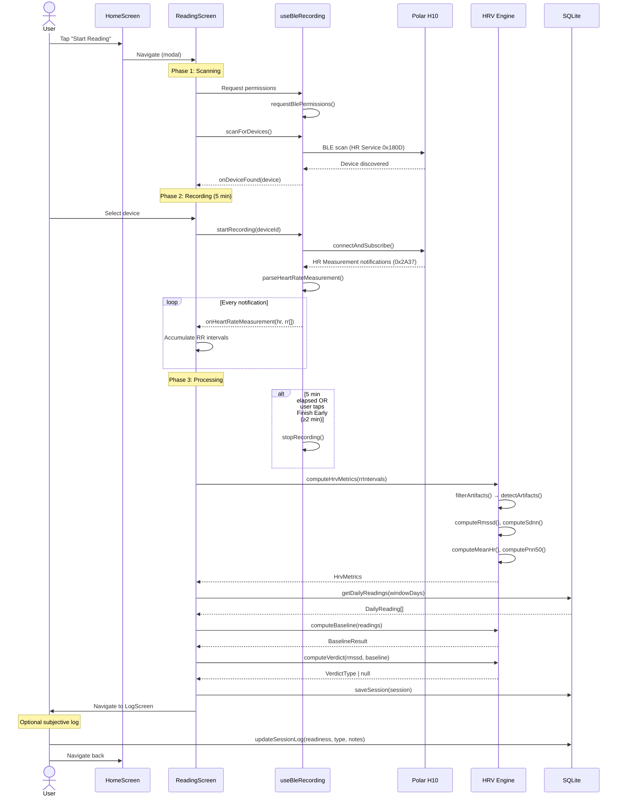
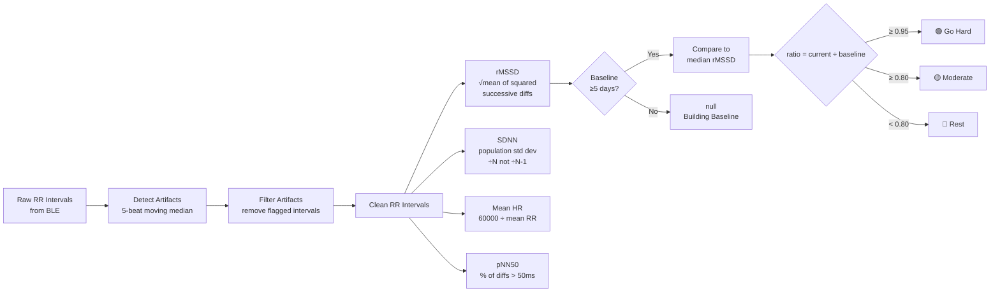
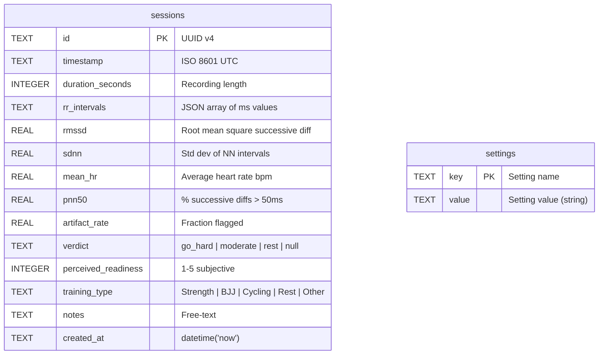
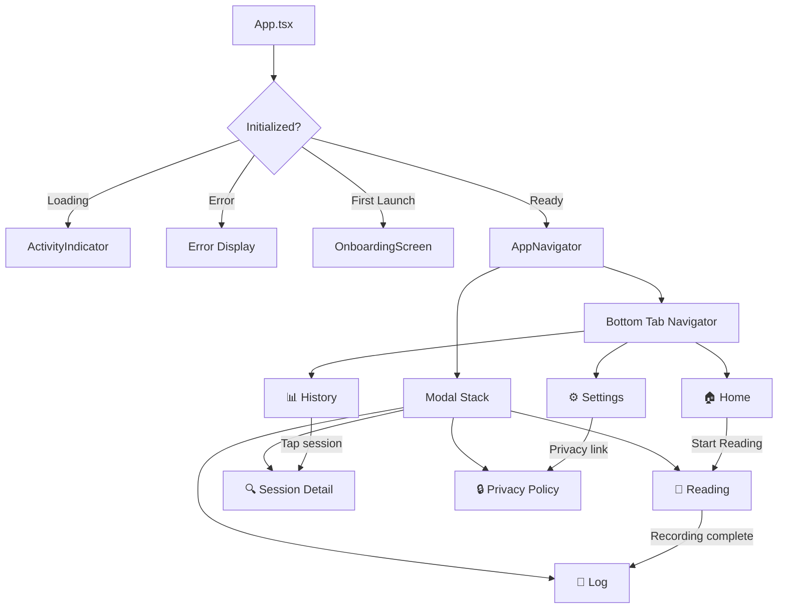
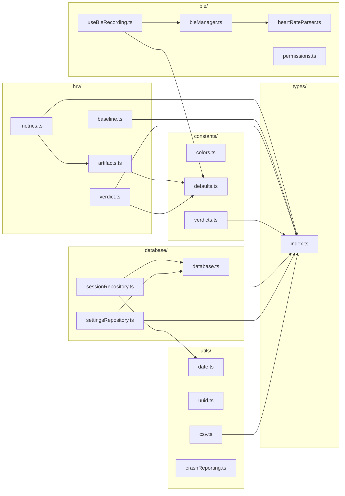

# Architecture Overview

This document describes the architecture, data flow, and key design decisions of the HRV Morning Readiness Dashboard.

## System Overview

The app follows a layered architecture with clear separation between BLE communication, HRV computation, data persistence, and presentation.

```mermaid
graph TB
    subgraph Presentation["Presentation Layer"]
        Home[HomeScreen]
        Reading[ReadingScreen]
        History[HistoryScreen]
        Log[LogScreen]
        Settings[SettingsScreen]
        Detail[SessionDetailScreen]
        Onboarding[OnboardingScreen]
        Privacy[PrivacyPolicyScreen]
    end

    subgraph Components["UI Components"]
        Verdict[VerdictDisplay]
        Sparkline[Sparkline]
        StatCard[StatCard]
        RRPlot[RRPlot]
        Timer[CountdownTimer]
        Slider[ReadinessSlider]
        ErrorBound[ErrorBoundary]
    end

    subgraph Navigation["Navigation"]
        AppNav[AppNavigator]
        Tabs[Bottom Tabs]
        Stack[Modal Stack]
    end

    subgraph Domain["Domain Layer"]
        Metrics[HRV Metrics]
        Artifacts[Artifact Detection]
        Baseline[Baseline Computation]
        VerdictLogic[Verdict Logic]
    end

    subgraph BLE["BLE Layer"]
        BleManager[BLE Manager]
        Parser[HR Parser]
        Permissions[Permissions]
        Hook[useBleRecording]
    end

    subgraph Data["Data Layer"]
        DB[SQLite Database]
        SessionRepo[Session Repository]
        SettingsRepo[Settings Repository]
    end

    subgraph External["External"]
        PolarH10[Polar H10 / HR Monitor]
    end

    Home --> Verdict & Sparkline & StatCard
    Reading --> Hook & Timer & RRPlot
    History --> Sparkline & Detail
    Log --> Slider & Verdict

    Hook --> BleManager --> Parser
    BleManager --> PolarH10
    Hook --> Permissions

    Reading -->|Save session| SessionRepo
    Home -->|Load today| SessionRepo
    Home -->|Load baseline| SessionRepo
    History -->|Load all| SessionRepo
    Settings --> SettingsRepo

    SessionRepo --> DB
    SettingsRepo --> DB

    Home -->|Compute| Baseline --> VerdictLogic
    Reading -->|Compute| Metrics --> Artifacts
```



## Data Flow: Morning Reading

The core use case — taking a morning HRV reading — follows this sequence:



## HRV Computation Pipeline



## Artifact Detection Algorithm

The artifact detector uses a local 5-beat moving median to identify physiologically implausible RR intervals:

```mermaid
flowchart TD
    Input[RR Intervals Array] --> Check{Length ≥ 5?}
    Check -->|No| AllClean[Return all false<br/>no artifacts]
    Check -->|Yes| Loop[For each RR interval i]

    Loop --> Window[Extract window<br/>±2 beats around i]
    Window --> Median[Compute local<br/>median of window]
    Median --> Dev{deviation =<br/>|RR_i - median| ÷ median}
    Dev -->|> 0.20| Artifact[Flag as artifact ✗]
    Dev -->|≤ 0.20| Clean[Mark as clean ✓]
    Artifact --> Next
    Clean --> Next[Next interval]
```

## Database Schema



**Key settings keys:**

| Key | Type | Default | Description |
|-----|------|---------|-------------|
| `baselineWindowDays` | int | `7` | Rolling baseline window (5, 7, 10, 14) |
| `goHardThreshold` | float | `0.95` | Ratio for Go Hard verdict |
| `moderateThreshold` | float | `0.80` | Ratio for Moderate verdict |
| `pairedDeviceId` | string | `null` | Remembered BLE device ID |
| `pairedDeviceName` | string | `null` | Remembered BLE device name |
| `onboarding_complete` | string | — | `"true"` after onboarding |

## Navigation Structure



## Module Dependency Graph



## Key Design Decisions

### Why Median (not Mean) for Baseline?

The 7-day rMSSD baseline uses the **median** rather than the arithmetic mean. A single outlier session (e.g., a recording taken during a panic attack or with poor sensor contact) would skew a mean-based baseline, but median is resistant to this. This is standard practice in HRV research for rolling baselines.

### Why Population Std Dev (÷N) for SDNN?

SDNN uses `÷ N` (population std dev) rather than `÷ (N-1)` (sample std dev). In HRV analysis, the RR intervals represent the complete set of heartbeats recorded during the session — not a sample from a larger population. The population standard deviation is therefore the correct formula.

### Why 5-Minute Recording Duration?

The European Society of Cardiology recommends a minimum 5-minute recording for short-term HRV analysis. The 2-minute early-finish option is provided as a compromise — enough data for a reasonable estimate while accommodating user impatience, but a warning is shown if artifact rate exceeds 5%.

### Why Heart Rate Service Only (No PMD/Raw ECG)?

The Polar H10 supports both the standard Heart Rate Service (0x180D) and a proprietary PMD (Polar Measurement Data) service for raw ECG. V1 uses only the standard service because:
- It works with **any** BLE heart rate monitor, not just Polar
- RR intervals from the HR service are sufficient for time-domain HRV metrics
- No custom SDK dependency required
- Simpler permission model

### Why Local-Only Storage?

All data stays on-device in SQLite. This eliminates:
- Privacy concerns around health data
- Need for user accounts or authentication
- Server infrastructure and costs
- Network dependency for a morning-routine app

Export is available via CSV for users who want to analyze data externally.
