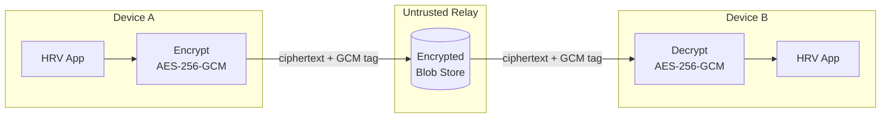
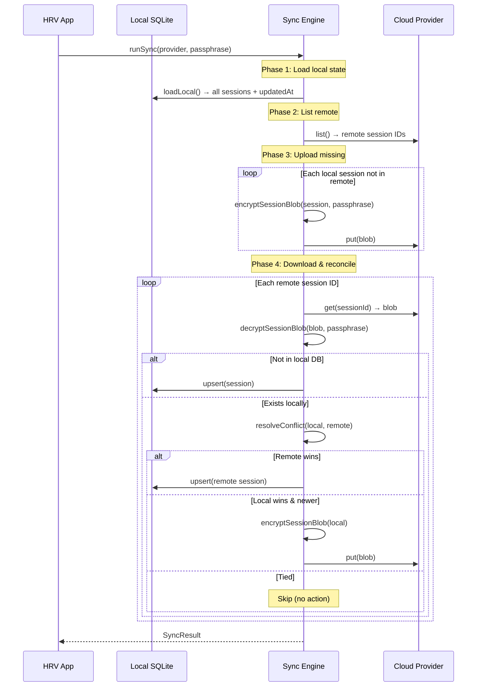
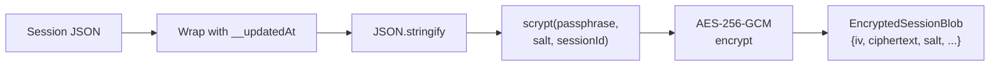

# Sync Architecture

End-to-end encrypted cloud sync for the HRV Morning Readiness Dashboard.
The sync subsystem replicates HRV sessions between devices through an
**untrusted relay** — the server never sees plaintext.

## Overview



**Key invariant:** The relay only stores opaque blobs. Decryption requires
the user's passphrase, which never leaves the device.

## Protocol Version

| Version | KDF | Cipher | Integrity | Status |
|---------|-----|--------|-----------|--------|
| v1 | Iterated SHA-256 | SHA-256 CTR XOR | SHA-256 of plaintext | Legacy (read-only) |
| v2 | Iterated SHA-256 | SHA-256 CTR XOR | HMAC-SHA-256 | Legacy (read-only) |
| v3 | Iterated SHA-256 (10k rounds) | AES-256-GCM | GCM tag | Legacy (read-only) |
| **v4** | **scrypt (N=2¹⁴, r=8, p=1)** | **AES-256-GCM** | **GCM tag** | **Current** |

New encryptions always emit v4. Legacy blobs decrypt transparently and
upgrade to v4 on the next sync round. See [`CRYPTO.md`](./CRYPTO.md)
for wire formats and migration SQL.

## Core Data Structures

### `EncryptedSessionBlob`

What providers store — the on-the-wire envelope:

```ts
interface EncryptedSessionBlob {
  protocolVersion: number;   // 1–4
  sessionId: string;         // UUID v4
  updatedAt: string;         // ISO 8601 (also AEAD-bound inside payload for v3+)
  iv: string;                // 24 hex chars (12 bytes)
  ciphertext: string;        // hex; trailing 32 hex chars = 16-byte GCM tag
  mac?: string;              // v2 only: HMAC-SHA-256
  salt?: string;             // v4 only: 32 hex chars (16-byte scrypt salt)
}
```

### `SyncProvider`

The provider abstraction — any storage backend implements this:

```ts
interface SyncProvider {
  id: string;
  list(): Promise<string[]>;
  get(sessionId: string): Promise<EncryptedSessionBlob | null>;
  put(blob: EncryptedSessionBlob): Promise<void>;
  remove(sessionId: string): Promise<void>;
}
```

### `SyncResult`

Outcome of a sync round:

```ts
interface SyncResult {
  uploaded: number;
  downloaded: number;
  conflictsResolved: number;
  skipped: number;
  errors: Array<{ sessionId: string; message: string }>;
}
```

## Sync Flow



## Conflict Resolution

**Strategy:** Last-writer-wins by `updatedAt` timestamp, with ties favoring
local (to prevent upload flapping).

```ts
function resolveConflict(local, remote): 'local' | 'remote' {
  if (remote.blob.updatedAt > local.updatedAt) return 'remote';
  return 'local'; // local wins ties
}
```

### Tamper protection

For v3+ blobs, `updatedAt` is **AEAD-bound inside the encrypted payload**:

```ts
interface SyncPayloadV3 {
  __updatedAt: string;  // must match envelope's updatedAt
  session: Session;
}
```

On decrypt, the engine verifies `parsed.__updatedAt === blob.updatedAt`.
A compromised relay cannot rewrite the envelope timestamp to force stale
data to win — the GCM tag would fail verification.

## Key Derivation

### v4 (current) — scrypt

```
passphrase ─┐
             ├─ scrypt(N=2¹⁴, r=8, p=1, dkLen=32) ──→ 32-byte AES key
random salt ─┤
sessionId ───┘  (composed salt = randomSalt || ":" || sessionId)
```

- **16-byte random salt** per blob (stored in envelope)
- **sessionId** bound into KDF → different key per session
- **~16 MiB RAM** per derivation → offline brute-force is 10⁴–10⁵× costlier than v3
- **~50–100 ms** on mobile (acceptable for per-session encryption)

Parameters are implied by protocol version — not stored on the wire.

### v3 (legacy) — Iterated SHA-256

10,000 rounds of SHA-256 over `${passphrase}:${sessionId}`. No random salt.

## Encryption Pipeline



### Encrypt (`encryptSessionBlob`)

1. Wrap session: `{ __updatedAt, session }`
2. Serialize to JSON
3. Generate random 16-byte salt
4. Derive key: `scrypt(passphrase, salt + ":" + sessionId)`
5. Generate random 12-byte IV
6. AES-256-GCM encrypt → ciphertext with appended 16-byte GCM tag
7. Return `EncryptedSessionBlob` envelope

### Decrypt (`decryptSessionBlob`)

1. Validate protocol version (reject if newer than client)
2. Validate v4 requires salt, v1–v3 must not have salt
3. Derive key using appropriate KDF for version
4. AES-256-GCM decrypt (GCM tag validates integrity)
5. Parse JSON
6. For v3+: verify `parsed.__updatedAt === blob.updatedAt`
7. Return `Session`

## Providers

### Supabase (production)

PostgreSQL-backed with Row-Level Security:

```sql
CREATE TABLE hrv_session_blobs (
  user_id UUID NOT NULL REFERENCES auth.users ON DELETE CASCADE,
  session_id TEXT NOT NULL,
  protocol_version INT NOT NULL,
  updated_at TIMESTAMPTZ NOT NULL,
  iv TEXT NOT NULL,
  ciphertext TEXT NOT NULL,
  mac TEXT,           -- v2 only; NULL for v3/v4
  salt TEXT,          -- v4 only; NULL for v1/v2/v3
  PRIMARY KEY (user_id, session_id)
);

-- Users can only access their own rows
ALTER TABLE hrv_session_blobs ENABLE ROW LEVEL SECURITY;
CREATE POLICY own_rows ON hrv_session_blobs
  USING (auth.uid() = user_id) WITH CHECK (auth.uid() = user_id);
```

### R2 / S3-compatible (production)

Object storage via pre-signed URLs:

- **Object layout:** `<user-prefix>/<sessionId>.json`
- **Signing:** URLs generated server-side after user authentication
- **Operations:** Standard GET/PUT/DELETE + ListObjectsV2

### In-Memory (testing)

`Map<string, EncryptedSessionBlob>` implementing `SyncProvider`.
Used in unit tests and as a reference implementation.

## Trust Model

The sync system assumes a **zero-trust relay**:

| Threat | Mitigation |
|--------|------------|
| Provider compromise | Attacker sees only ciphertext; scrypt makes offline brute-force expensive |
| Man-in-the-middle | Blobs encrypted before leaving device; GCM tag prevents tampering |
| Timestamp rewriting | AEAD-bound `updatedAt` inside payload validates against envelope (v3+) |
| Blob insertion | Decryption fails for blobs encrypted with a different passphrase |
| Blob deletion | Sync detects missing blobs and re-uploads from local state |

## Error Handling

- **Cryptographic errors** throw immediately: wrong passphrase, corrupt
  ciphertext, protocol version mismatch, missing required fields
- **Provider errors** (network, HTTP 4xx/5xx) are caught per-session and
  collected in `SyncResult.errors[]`
- `runSync()` never throws — all errors are surfaced in the result

## Related Systems

- **[Share bundles](../src/share/)** — Time-boxed encrypted session bundles
  for coach sharing. Reuses the same `encryptString`/`decryptString` pipeline
  with CSPRNG pairing-code passphrases.
- **[Encrypted backups](../src/utils/backup.ts)** — `.hrvbak` files using
  the same AES-256-GCM + scrypt cipher. Single-file export for manual transfer.
- **[Crypto protocol reference](./CRYPTO.md)** — Full wire format
  specifications, migration SQL, and defense-in-depth dispatch hardening.
