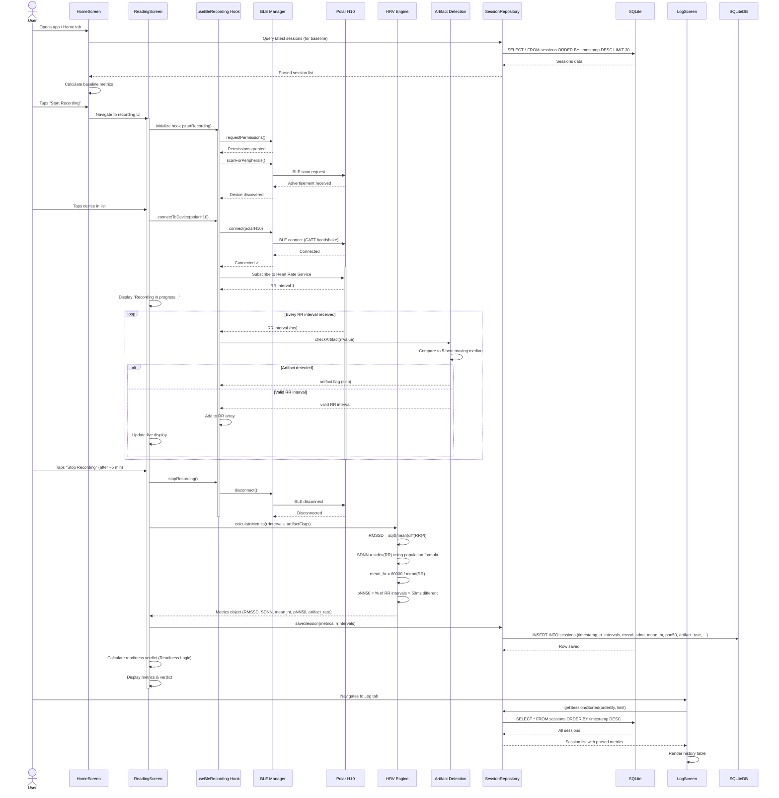

# Data Flow

This document traces the complete flow of data through the application during a morning HRV reading session.

## Morning Reading Sequence

## Phase Details

### 1. **Initialization & Baseline**
- App loads home screen
- Repository queries last 30 sessions from SQLite
- Readiness Logic calculates baseline metrics (median RMSSD, etc.)

### 2. **Scan Phase**
- BLE hook requests Bluetooth permissions
- BLE Manager initiates peripheral scan
- Polar H10 advertisement is detected
- User selects device from list

### 3. **Connect Phase**
- BLE Manager establishes GATT connection
- Heart Rate Service is discovered and subscribed to
- RR intervals begin streaming

### 4. **Record Phase**
- Polar H10 sends RR intervals (every beat)
- Artifact Detection filters physiologically implausible values
- Valid RR intervals accumulate in state
- UI shows live HR and interval count

### 5. **Process Phase**
- User stops recording after ~5 minutes
- HRV Engine calculates metrics from validated RR array:
  - **RMSSD**: Root mean square of successive differences
  - **SDNN**: Standard deviation (population formula, not sample)
  - **mean_hr**: Average heart rate
  - **pNN50**: Percentage of intervals with > 50ms difference
  - **artifact_rate**: % of RR intervals removed

### 6. **Save Phase**
- Session object (timestamp, metrics, RR array as JSON, notes) inserted into SQLite
- Repository returns success

### 7. **Log Phase**
- LogScreen queries all sessions from database
- Displays sortable/filterable history table
- Each row shows date, time, verdict, and key metrics

---

## Critical Data Transformations

| Stage | Input | Processing | Output |
|-------|-------|-----------|--------|
| **BLE→Artifact** | RR intervals (ms) | 5-beat moving median filter | Valid RR intervals + flags |
| **RR→HRV** | Valid RR array | RMSSD, SDNN formulas | Numeric metrics |
| **Metrics→Readiness** | Current metrics + baseline | Compare to thresholds | Verdict (Go Hard / Moderate / Rest) |
| **Session→Storage** | Metrics object + RR array | JSON serialize | SQLite INSERT |
| **Storage→Display** | SQLite rows | JSON parse + format | Rendered UI table |

---

## Error Handling & Fallbacks

- **BLE connection fails**: User can retry scan
- **Recording interrupted**: UI prompts to discard or save partial data
- **High artifact rate (>40%)**: Warning displayed; user advised to re-wet electrodes or adjust sensor contact
- **Baseline insufficient**: "Building Baseline" message; normal readings still recorded

