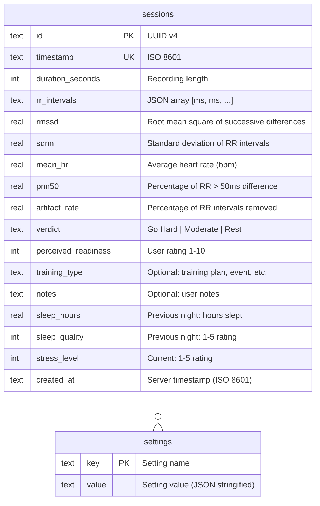

# Database Schema

The HRV Dashboard uses SQLite for local-only data storage. All data is persisted on the device with no cloud synchronization.

## Entity-Relationship Diagram



## Tables

### `sessions` Table

**Primary Key**: `id` (TEXT, UUID v4)  
**Unique Index**: `(timestamp)`  
**Total Columns**: 16

| Column | Type | Required | Description |
|--------|------|----------|-------------|
| `id` | TEXT | ✓ | UUID v4 primary key |
| `timestamp` | TEXT | ✓ | ISO 8601 datetime (e.g., "2024-01-15T06:30:00Z"); start time of recording |
| `duration_seconds` | INTEGER | ✓ | Recording duration in seconds (typically ~300 for 5 min) |
| `rr_intervals` | TEXT | ✓ | JSON array of RR intervals in milliseconds; e.g., `[600, 620, 580, ...]` |
| `rmssd` | REAL | ✓ | Root mean square of successive differences (ms); primary HRV metric |
| `sdnn` | REAL | ✓ | Standard deviation of RR intervals (ms); time-domain variability |
| `mean_hr` | REAL | ✓ | Average heart rate (bpm); calculated as 60000 / mean(RR) |
| `pnn50` | REAL | ✓ | Percentage of RR intervals with > 50ms difference (0–100) |
| `artifact_rate` | REAL | ✓ | Percentage of RR intervals removed as artifacts (0–100) |
| `verdict` | TEXT | ✓ | Readiness verdict: "Go Hard", "Moderate", or "Rest" |
| `perceived_readiness` | INTEGER | ✗ | User's subjective readiness rating (1–10 scale); NULL if not provided |
| `training_type` | TEXT | ✗ | Optional: planned training type (e.g., "strength", "cardio", "easy recovery") |
| `notes` | TEXT | ✗ | Optional: user notes or context (e.g., "Poor sleep", "Recovered well") |
| `sleep_hours` | REAL | ✗ | Hours of sleep previous night; NULL if not entered |
| `sleep_quality` | INTEGER | ✗ | Sleep quality rating (1–5); NULL if not entered |
| `stress_level` | INTEGER | ✗ | Current stress level (1–5); NULL if not entered |
| `created_at` | TEXT | ✓ | Server/local timestamp when record was created (ISO 8601) |

**Example Row**:
```json
{
  "id": "550e8400-e29b-41d4-a716-446655440000",
  "timestamp": "2024-01-15T06:30:00Z",
  "duration_seconds": 300,
  "rr_intervals": "[612, 598, 625, 615, 622, ...]",
  "rmssd": 45.3,
  "sdnn": 52.1,
  "mean_hr": 62.5,
  "pnn50": 38.2,
  "artifact_rate": 2.1,
  "verdict": "Go Hard",
  "perceived_readiness": 8,
  "training_type": "strength",
  "notes": "Great night's sleep",
  "sleep_hours": 8.5,
  "sleep_quality": 5,
  "stress_level": 2,
  "created_at": "2024-01-15T06:32:15Z"
}
```

---

### `settings` Table

**Primary Key**: `key` (TEXT)  
**Total Columns**: 2

| Column | Type | Description |
|--------|------|-------------|
| `key` | TEXT | Setting identifier (e.g., "baselineWindowDays") |
| `value` | TEXT | Value as JSON string; always call `JSON.parse()` when reading |

**Standard Settings Keys**:

| Key | Type | Default | Description |
|-----|------|---------|-------------|
| `baselineWindowDays` | Integer | 30 | Number of past days to use for baseline calculation |
| `goHardThreshold` | Number (JSON) | 1.0 | Multiplier for RMSSD above which verdict is "Go Hard" (baseline × threshold) |
| `moderateThreshold` | Number (JSON) | 0.75 | Multiplier for RMSSD above which verdict is "Moderate" (baseline × threshold) |
| `pairedDeviceId` | String | null | UUID of paired Polar device |
| `pairedDeviceName` | String | null | Display name of paired device (e.g., "Polar H10 ABC123") |
| `onboarding_complete` | Boolean (JSON) | false | Whether user has completed first-run setup |
| `schema_version` | Integer (JSON) | 2 | Current database schema version |

**Example Settings**:
```sql
-- Baseline window
INSERT INTO settings (key, value) VALUES ('baselineWindowDays', '30');

-- Thresholds
INSERT INTO settings (key, value) VALUES ('goHardThreshold', '1.0');
INSERT INTO settings (key, value) VALUES ('moderateThreshold', '0.75');

-- Device pairing
INSERT INTO settings (key, value) VALUES ('pairedDeviceId', '"A1B2C3D4E5"');
INSERT INTO settings (key, value) VALUES ('pairedDeviceName', '"Polar H10 ABC123"');

-- Onboarding
INSERT INTO settings (key, value) VALUES ('onboarding_complete', 'true');

-- Schema version
INSERT INTO settings (key, value) VALUES ('schema_version', '2');
```

---

## Schema Migrations

### V0 → V1: Initial Schema
- Created `sessions` and `settings` tables
- Baseline functionality, no sleep/stress tracking

**Migration SQL**:
```sql
CREATE TABLE sessions (
  id TEXT PRIMARY KEY,
  timestamp TEXT UNIQUE NOT NULL,
  duration_seconds INTEGER NOT NULL,
  rr_intervals TEXT NOT NULL,
  rmssd REAL NOT NULL,
  sdnn REAL NOT NULL,
  mean_hr REAL NOT NULL,
  pnn50 REAL NOT NULL,
  artifact_rate REAL NOT NULL,
  verdict TEXT NOT NULL,
  perceived_readiness INTEGER,
  training_type TEXT,
  notes TEXT,
  created_at TEXT NOT NULL
);

CREATE TABLE settings (
  key TEXT PRIMARY KEY,
  value TEXT NOT NULL
);

INSERT INTO settings (key, value) VALUES ('schema_version', '1');
```

### V1 → V2: Sleep & Stress Tracking
- Added `sleep_hours`, `sleep_quality`, `stress_level` columns to `sessions`
- Enables richer context for readiness interpretation

**Migration SQL**:
```sql
ALTER TABLE sessions ADD COLUMN sleep_hours REAL;
ALTER TABLE sessions ADD COLUMN sleep_quality INTEGER;
ALTER TABLE sessions ADD COLUMN stress_level INTEGER;

UPDATE settings SET value = '2' WHERE key = 'schema_version';
```

---

## Indexes

```sql
CREATE UNIQUE INDEX idx_sessions_timestamp ON sessions(timestamp);
CREATE INDEX idx_sessions_created_at ON sessions(created_at);
```

These indexes optimize:
- **Unique constraint on timestamp**: Prevent duplicate readings at exact same time
- **Created_at index**: Fast querying by date range (sorting, pagination)

---

## Constraints & Validation

- **`rmssd`, `sdnn`, `mean_hr`, `pnn50`, `artifact_rate`**: Must be ≥ 0
- **`verdict`**: Only "Go Hard", "Moderate", or "Rest"
- **`sleep_quality`, `stress_level`**: 1–5 scale if provided
- **`perceived_readiness`**: 1–10 scale if provided
- **`rr_intervals`**: Valid JSON array of numbers (ms)

---

## Data Retention & Export

- **Retention**: All sessions stored indefinitely (no automatic cleanup)
- **Export**: CSV export available from LogScreen (queries all sessions, formats as rows)
- **Backup**: Device backup/restore handled by OS (Settings > Apps > HRV Dashboard)

