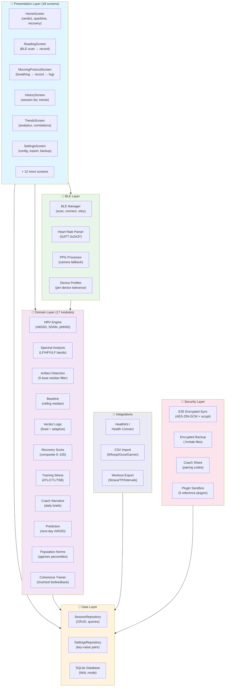

# Architecture Overview

The HRV Morning Readiness Dashboard follows a **layered architecture** that separates concerns between presentation, domain logic, data access, hardware communication, and optional cloud services. This design enables testability, maintainability, and clear dependencies.

## Architectural Layers

## Layer Descriptions

### 📱 Presentation Layer (18 screens)
React Native screens and reusable UI components. Key screens: HomeScreen (today's verdict), ReadingScreen (BLE recording), MorningProtocolScreen (guided 3-phase flow), HistoryScreen (session list), TrendsScreen (weekly analytics), SettingsScreen (configuration), plus CoherenceScreen, OrthostaticScreen, ImportScreen, PluginsScreen, ProfilesScreen, and more.

### 🧠 Domain Layer (17 modules)
Pure business logic with no side effects — highly testable. Covers: HRV metrics, spectral analysis, artifact detection, baseline computation, verdict logic (fixed + adaptive), recovery scoring, training stress (ATL/CTL/TSB), coach narrative, prediction, population norms, ANS balance, sleep architecture, circadian analysis, and coherence biofeedback.

### 💾 Data Layer
Repository pattern for SQLite access. SessionRepository handles session CRUD and queries. SettingsRepository provides key-value configuration storage. Database initialization includes migration management and WAL mode.

### 🔗 BLE Layer
Hardware communication via react-native-ble-plx. Supports any BLE heart rate monitor via standard Heart Rate Service (0x180D). Includes camera PPG processor as a no-strap fallback and device profiles for per-device artifact tolerance tuning.

### 🔌 Integrations
Two-way HealthKit/Health Connect sync, CSV import wizard (Whoop/Oura/Garmin/EliteHRV/HRV4Training), and workout export to Strava, TrainingPeaks, and Intervals.icu.

### 🔐 Security Layer
End-to-end encrypted cloud sync (AES-256-GCM with scrypt KDF), encrypted backup/restore, coach share bundles with CSPRNG pairing codes, and sandboxed plugin execution with static source auditing.

---

## Key Design Principles

- **Separation of Concerns**: Each layer has a single responsibility
- **Testability**: Domain logic is pure functions; 1,000+ unit tests
- **Local-First**: All data on device by default; cloud is opt-in and encrypted
- **Type Safety**: Full TypeScript strict mode across the codebase
- **Privacy by Default**: No telemetry, no analytics, no network calls unless user opts in
- **Extensibility**: Plugin system for custom metrics, open import parsers for new vendors

