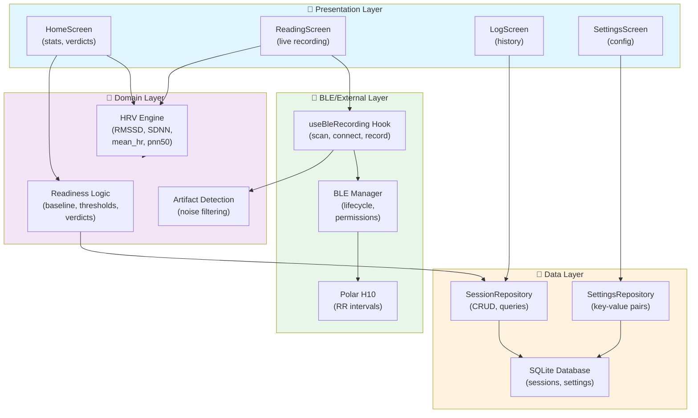

# Architecture Overview

The HRV Morning Readiness Dashboard follows a **layered architecture** that separates concerns between presentation, domain logic, data access, and hardware communication. This design enables testability, maintainability, and clear dependencies.

## Architectural Layers

## Layer Descriptions

### 📱 Presentation Layer
**Screens and UI components** that display data and handle user interactions.

- **HomeScreen**: Displays today's HRV metrics and readiness verdict; allows starting a new recording
- **ReadingScreen**: Shows live RR intervals during recording; handles BLE connection feedback
- **LogScreen**: Lists past sessions with sortable/filterable history
- **SettingsScreen**: Configure device pairing, threshold adjustments, and other preferences

Dependencies: Domain logic, repositories, BLE hooks

---

### 🧠 Domain Layer
**Pure business logic** that operates on data without side effects. Highly testable.

- **HRV Engine**: Calculates RMSSD, SDNN, mean HR, pNN50 from RR intervals
- **Readiness Logic**: Compares current metrics against baseline; assigns verdict (Go Hard / Moderate / Rest)
- **Artifact Detection**: Identifies and filters physiologically implausible RR intervals (> 5-beat median)

Dependencies: None (pure functions)

---

### 💾 Data Layer
**Repository pattern** for database access and persistence.

- **SessionRepository**: Save, retrieve, update sessions; query by date range, export to CSV
- **SettingsRepository**: Get/set key-value configuration (baseline window, thresholds, device ID, etc.)
- **SQLite Database**: Local-only storage; no network, no cloud sync

Dependencies: Data access driver

---

### 🔗 BLE/External Layer
**Hardware communication** and sensor integration.

- **useBleRecording Hook**: React hook for scan, connect, record lifecycle; manages BLE state
- **BLE Manager**: Handles Android/iOS permissions, device lifecycle, connection stability
- **Polar H10**: Bluetooth LE Heart Rate Service; streams RR intervals as received values

Dependencies: Native modules (react-native-ble-plx), OS permissions

---

## Data Flow at a Glance

1. **User opens app** → HomeScreen loads baseline from database
2. **User taps "Record"** → ReadingScreen activates BLE hook
3. **BLE scans & connects** to Polar H10 → RR intervals stream in
4. **HRV Engine processes** RR intervals → calculates metrics
5. **Recording ends** → SessionRepository saves to SQLite
6. **HomeScreen displays** new verdict from Readiness Logic

See [Data Flow](./data-flow.md) for detailed sequence diagrams.

---

## Key Design Principles

- **Separation of Concerns**: Each layer has a single responsibility
- **Testability**: Domain logic is pure; easily unit tested
- **Modularity**: Components/hooks are composable and reusable
- **Local-First**: All data stays on device; no network dependency
- **Type Safety**: Full TypeScript strict mode across codebase

