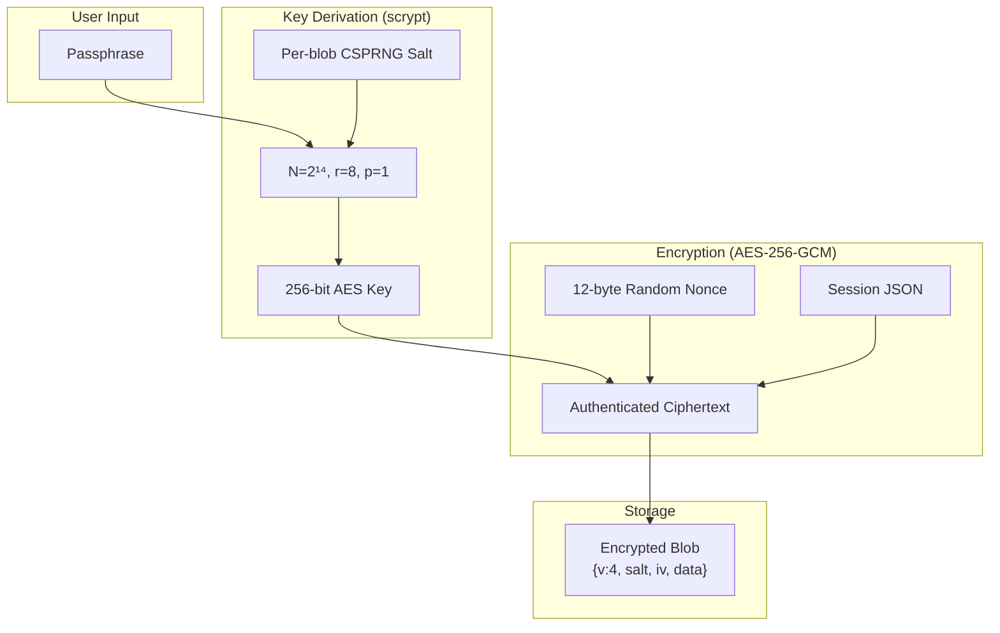

# Security Architecture

This document describes the security architecture, encryption protocols, and threat model for the HRV Dashboard's data protection features.

## Cryptographic Overview



## Protocol v4 Details

### Key Derivation

```
passphrase → scrypt(N=16384, r=8, p=1, dkLen=32, salt) → 256-bit key
```

- **Memory cost**: ~16 MB per key derivation (prevents GPU attacks)
- **Salt**: 32-byte CSPRNG value, unique per blob
- **Context binding**: Different contexts (sync, share, backup) derive different keys from the same passphrase

### Encryption

```
key + nonce + plaintext → AES-256-GCM → ciphertext + authentication tag
```

- **Nonce**: 12-byte random, unique per encryption
- **Authentication**: GCM provides authenticated encryption — any tampering is detected on decryption
- **No padding oracle**: GCM is a stream cipher mode, immune to padding oracle attacks

### Wire Format

```json
{
  "v": 4,
  "salt": "<64 hex chars = 32 bytes>",
  "iv": "<24 hex chars = 12 bytes>",
  "data": "<base64-encoded AES-256-GCM ciphertext with auth tag>"
}
```

## Backward Compatibility

| Version | Encrypt? | Decrypt? | Notes |
|---------|----------|----------|-------|
| v1 (SHA-256 CTR-XOR) | ❌ | ✅ | No authentication — read-only for migration |
| v2 (CTR + HMAC-SHA-256) | ❌ | ✅ | Encrypt-then-MAC — read-only for migration |
| v3 (AES-256-GCM, SHA-256 KDF) | ❌ | ✅ | Iterated SHA-256 KDF — less resistant to GPU |
| **v4 (AES-256-GCM, scrypt)** | ✅ | ✅ | **Current protocol** |

## Plugin Sandbox Security

Plugins execute in a restricted environment:

| Control | Implementation |
|---------|---------------|
| **Execution timeout** | 250ms hard limit |
| **No network** | `fetch`, `XMLHttpRequest` blocked |
| **No globals** | `globalThis`, `window`, `process` blocked |
| **No code generation** | `eval`, `Function` constructor blocked |
| **No module system** | `require`, `import` blocked |
| **Static audit** | Source scanned for forbidden tokens before compilation |
| **Fingerprint verification** | SHA-256 of source verified at install time |
| **Read-only data** | Only `read:session` permission granted |

## Threat Model

| Threat | Risk | Mitigation |
|--------|------|-----------|
| **Device theft** | Medium | OS-level device encryption (FileVault/FDE). App-level SQLite is not independently encrypted. |
| **Sync server breach** | Low | Server stores only AES-256-GCM ciphertext. Without passphrase, data is computationally indistinguishable from random. |
| **Brute-force passphrase** | Low | scrypt with N=2¹⁴ requires ~16 MB per guess. At $1/hr cloud GPU rates, cracking a 4-word passphrase takes ~$500K in compute. |
| **Network MITM** | Low | HTTPS/TLS for transport + AES-256-GCM application-layer encryption (double encryption). |
| **Share interception** | Low | 7-day TTL + scrypt KDF. Pairing code shared via separate channel (verbal, phone). |
| **Malicious plugin** | Low | Sandboxed execution with no I/O capabilities. Cannot exfiltrate data. |
| **Supply chain** | Low | `@noble/ciphers` and `@noble/hashes` are audited, pure-JS libraries with no native dependencies. |

## Recommendations

1. **Use a strong sync passphrase** — at least 4 random words or 12+ characters
2. **Share pairing codes verbally** — not in the same channel as the encrypted bundle
3. **Enable device encryption** — iOS and Android both offer full-disk encryption
4. **Review plugins before installing** — the static audit catches common attack vectors, but review source code for complex plugins
