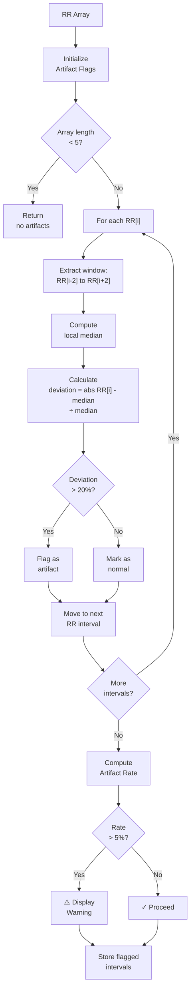

# Artifact Detection

## What Are Artifacts?

During a 5-minute HRV recording, your Polar H10 chest strap reads electrical signals from your heart and streams RR intervals (beat-to-beat times) to your phone. In ideal conditions, this signal is clean. But in the real world, several sources of noise can corrupt the data:

- **Ectopic beats** – Premature or irregular heartbeats that don't follow your normal rhythm
- **Sensor noise** – Electromagnetic interference, poor electrode contact, or drift in the sensor
- **Movement artifacts** – Muscle movement under the strap or loose strap-to-skin contact

These corrupted intervals don't reflect your true cardiac autonomic state and will skew your HRV metrics. The app detects and flags these outliers so they can be removed before metric computation.

## The 5-Beat Moving Median Algorithm

The artifact detection algorithm is fast, robust, and requires no manual tuning:

### Algorithm Steps

1. **For each RR interval** in your recording, extract a **window of ±2 surrounding beats** (total 5 intervals).
   - Example: To evaluate interval #10, look at intervals #8, #9, #10, #11, #12.

2. **Compute the local median** of this 5-beat window.

3. **Calculate the relative deviation:**
   ```
   deviation = |RR[i] - median| / median
   ```

4. **Flag as artifact if** `deviation > 20%`
   - If an interval deviates more than 20% from the median of its neighbors, it's likely an outlier.

5. **Handle edge cases:** Arrays with fewer than 5 total intervals return no artifacts (there's insufficient context to evaluate).

### Example

```
RR intervals: [800, 810, 900, 850, 820, ...] ms

Evaluating interval #2 (900 ms):
  Window: [800, 810, 900, 850, 820]
  Median: 820 ms
  Deviation: |900 - 820| / 820 = 80 / 820 ≈ 9.8%
  Result: NOT flagged (< 20%)

Evaluating interval #1 (950 ms):
  Window: [800, 810, 900, 950, 850]
  Median: 900 ms
  Deviation: |950 - 900| / 900 ≈ 5.6%
  Result: NOT flagged (< 20%)

Evaluating interval #3 (1200 ms):
  Window: [810, 900, 1200, 850, 820]
  Median: 900 ms
  Deviation: |1200 - 900| / 900 ≈ 33%
  Result: FLAGGED artifact (> 20%)
```

## Artifact Rate Calculation

```
Artifact Rate = (number of flagged intervals) / (total intervals)
```

This yields a fraction from 0 to 1, often expressed as a percentage (0–100%).

- **0–1% artifact rate:** Excellent; no warning needed.
- **1–5% artifact rate:** Good; minor noise, but metrics are reliable.
- **5%+ artifact rate:** ⚠️ Warning displayed. Consider re-recording with better electrode contact.

## When Artifact Rate Exceeds 5%

If your recording shows **≥5% artifacts**, the app:
1. Displays a warning badge on your result screen.
2. Suggests re-checking your electrode contact and trying again.
3. Still stores the reading and computes metrics, but flags it as lower-confidence.

High artifact rates can happen if:
- Your chest strap is loose or moving
- Your electrodes are dry (sweat can actually improve contact, as counterintuitive as it sounds)
- You're moving excessively during the recording
- There's electrical interference nearby (phones, routers, etc.)

## Artifact Detection Flowchart



## Tips for Reducing Artifacts

1. **Ensure good skin contact:** Wipe your chest dry, then apply the strap snugly but not uncomfortably.
2. **Wet the electrodes:** If your skin is very dry, a small dab of water on the electrode pads improves signal quality.
3. **Stay still:** Minimize chest movement during the 5-minute recording. Sit or lie down comfortably.
4. **Avoid electrical interference:** Move away from microwave ovens, large electronics, or running Wi-Fi routers during the recording.
5. **Check strap placement:** The strap should sit directly over your ribs, not too high on your chest.
6. **Re-record if needed:** If you see a warning, it's worth 5 minutes to get a clean reading.

## What Happens to Flagged Intervals?

Flagged artifacts are:
- **Excluded from metric computation** – They don't contribute to rMSSD, SDNN, or pNN50.
- **Retained in the database** – Stored with a flag so you can review them if needed.
- **Reported as an artifact count** – Shown on your results screen for transparency.

Your metrics are computed only from *clean* intervals, ensuring your rMSSD and verdict are based on true cardiac autonomic data, not sensor noise.
