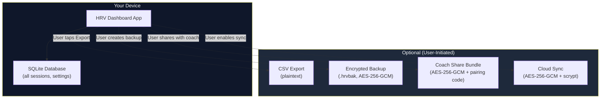

# Privacy & Encryption

The HRV Dashboard is designed with a **local-first, privacy-by-default** architecture. Your health data stays on your device unless you explicitly opt into sync, sharing, or backup — and when data does leave your device, it's always end-to-end encrypted.

## Privacy Architecture



### What the app does NOT do

- ❌ No analytics or tracking — no usage data is collected
- ❌ No third-party SDKs for analytics (only optional Sentry for crash reports, controlled by `SENTRY_DSN`)
- ❌ No network calls unless you enable sync
- ❌ No user accounts for core functionality
- ❌ No advertising or data monetization

## Encryption Protocol (v4)

All encrypted operations (sync, backup, share) use the same protocol:

| Property | Value |
|----------|-------|
| **Cipher** | AES-256-GCM (authenticated encryption with associated data) |
| **Key derivation** | scrypt (N=2¹⁴, r=8, p=1, dkLen=32 bytes) |
| **Salt** | Per-blob CSPRNG salt (prevents rainbow table attacks) |
| **IV/Nonce** | 12-byte random per encryption |
| **Authentication** | Built into GCM mode (no separate MAC needed) |
| **Library** | `@noble/ciphers` + `@noble/hashes` (pure JS, auditable, no native dependencies) |

### Why scrypt?

scrypt is a **memory-hard** key derivation function. Unlike PBKDF2 or bcrypt, scrypt requires significant RAM to compute, making GPU-based brute-force attacks impractical:

- **N=2¹⁴ (16,384)**: CPU/memory cost factor
- **r=8**: Block size
- **p=1**: Parallelization factor
- Each key derivation uses ~16 MB of RAM

### Protocol Version History

| Version | Cipher | KDF | Status |
|---------|--------|-----|--------|
| v1 | SHA-256 CTR-XOR | None | Decrypt only (legacy) |
| v2 | SHA-256 CTR + HMAC-SHA-256 | None | Decrypt only (legacy) |
| v3 | AES-256-GCM | SHA-256 (10k iterations) | Decrypt only (legacy) |
| **v4** | **AES-256-GCM** | **scrypt (N=2¹⁴)** | **Current** |

Legacy blobs (v1–v3) are automatically decrypted for backward compatibility. All new encryptions use v4.

## Backup Encryption

The `.hrvbak` backup file format:

```json
{
  "v": 4,
  "salt": "<hex-encoded per-backup salt>",
  "iv": "<hex-encoded 12-byte nonce>",
  "data": "<base64-encoded AES-256-GCM ciphertext>"
}
```

- **Creating a backup**: `createBackup(passphrase)` — encrypts all sessions + settings, saves to file system
- **Restoring a backup**: `restoreBackup(fileUri, passphrase)` — decrypts and imports sessions

## Share Bundle Security

Coach share bundles use the same v4 encryption with an additional constraint:

- **Pairing codes** are 4-word passphrases from a 256-word curated list (~32 bits of entropy)
- **Time-to-live**: Shares expire after 7 days by default
- The combination of scrypt KDF + short TTL makes brute-force impractical within the expiry window

## Threat Model

| Threat | Mitigation |
|--------|-----------|
| Device theft | Data at rest in SQLite (not encrypted at app level; relies on OS-level device encryption) |
| Sync server breach | Server stores only AES-256-GCM ciphertext; plaintext requires user passphrase |
| Network interception | HTTPS/TLS for transport + AES-256-GCM at application layer |
| Weak passphrase | scrypt memory-hard KDF makes brute-force expensive (~16 MB per attempt) |
| Share interception | Time-boxed TTL + scrypt KDF; pairing code shared via separate channel |
| Malicious plugin | Sandboxed execution (250ms timeout, no network, no globals, static audit) |

## Crash Reporting

When `SENTRY_DSN` is set, the app sends crash reports to Sentry. When unset, errors are logged to the console only. No health data is included in crash reports — only stack traces and device metadata.
