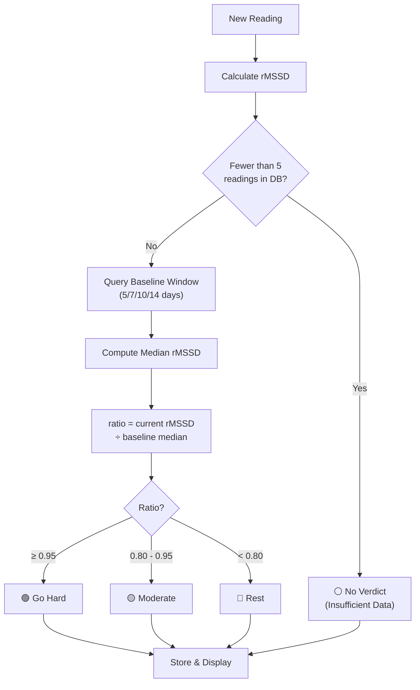

# Verdicts & Baseline

## The Three Verdicts

Each morning, after your 5-minute HRV recording, the app issues one of three verdicts based on how your current rMSSD compares to your personal baseline. These verdicts are designed to guide your training and recovery decisions.

| Verdict | Emoji | Condition | Meaning |
|---------|-------|-----------|---------|
| **Go Hard** | 🟢 | rMSSD ≥ 95% of baseline | Your nervous system is well-recovered. Optimal day for high-intensity training. |
| **Moderate** | 🟡 | rMSSD 80–95% of baseline | Reasonable recovery, but not peak. Good for steady-state or technical work. |
| **Rest** | 🔴 | rMSSD < 80% of baseline | Your HRV is suppressed. Consider recovery-focused activities or rest. |

These thresholds are evidence-based and aligned with HRV monitoring best practices in sports science. A 20% drop from baseline (Go Hard → Moderate threshold) is clinically meaningful and often correlates with measurable fatigue or recovery deficit.

## Baseline Computation

Your **baseline** is the **median rMSSD over a rolling window** (default: 7 days, but configurable to 5, 7, 10, or 14 days in Settings).

**Why median, not mean?**
- The median is **robust to outliers**. If you have one unusually high rMSSD day (e.g., exceptional recovery) or one unusually low day (e.g., illness), the median won't shift as dramatically as the mean would.
- It's more **representative of your typical state** rather than skewed by extreme days.
- It's the **recommended approach** in sports physiology literature.

### Example Baseline Calculation

If your 7-day rolling window shows rMSSD values of:
```
[45, 48, 52, 38, 55, 49, 51] ms (7 days)
Sorted: [38, 45, 48, 49, 51, 52, 55]
Median (4th value): 49 ms
```

Your baseline is **49 ms**. Tomorrow's verdict is based on how your rMSSD compares to 49.

## Minimum Baseline Requirement

**You need at least 5 days of readings** before the app will issue verdicts. This ensures your baseline is stable and representative, not skewed by a single anomalous day.

Until you have 5 readings:
- Metrics are displayed (rMSSD, SDNN, Mean HR, pNN50)
- No verdict is shown
- A message prompts you to continue recording for a more robust baseline

Once you reach 5+ readings, verdicts are live.

## Configurable Baseline Window

You can adjust the baseline window in **Settings**:
- **5 days** – responsive to recent changes, but less stable
- **7 days** – balanced (default)
- **10 days** – more stable, slower to respond to genuine improvements
- **14 days** – very stable, conservative approach

Shorter windows make verdicts more responsive to recent trends; longer windows smooth out day-to-day noise but may lag if your fitness state changes substantially.

## Verdict Logic Flowchart



## User-Configurable Thresholds

The 95%, 80%, and 5-day baseline window are **starting defaults**, but in future releases may be user-customizable in Settings to reflect individual preferences and coaching philosophies. For now, these industry-standard thresholds apply to all users.

## What a Verdict Means for Your Day

- **🟢 Go Hard**: Your parasympathetic tone is high, indicating full recovery. This is an ideal day for high-intensity work, PRs, or important competitions.
- **🟡 Moderate**: You're adequately recovered but not peak. Good for structured work, skill development, or moderate intensity.
- **🔴 Rest**: Your HRV is down, signaling fatigue, stress, or inadequate recovery. Prioritize recovery: easy movement, sleep, nutrition, stress management. Listen to your body.

**Remember:** Verdicts are a *guide*, not a rule. Combine your HRV verdict with how you *feel*, your sleep quality, stress levels, and training history for holistic decision-making.
