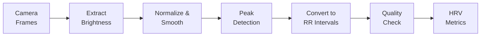

# Camera PPG (No-Strap Fallback)

Don't have a chest strap? The app can estimate your heart rate variability using your phone's **rear camera** and flashlight. Place your fingertip over the lens, and the app detects your pulse from subtle color changes in your skin.

## How It Works

1. Open the app → **Camera Reading** screen
2. Place your **index finger** gently over the rear camera lens
3. The flashlight turns on to illuminate your fingertip
4. Hold still for **60 seconds** (minimum recording duration)
5. The app processes the brightness signal to extract RR intervals



### Signal Processing Pipeline

1. **Normalize brightness** — zero-mean the raw brightness values
2. **Moving average smoothing** — reduce high-frequency noise
3. **Local maxima peak detection** — find heartbeat peaks (minimum 300ms apart)
4. **RR interval conversion** — calculate time between successive peaks
5. **Physiological range filter** — keep only intervals between 300–2500ms (24–200 bpm)

## Signal Quality

The app computes a **quality score** (0–1) based on three factors:

| Factor | Weight | What It Measures |
|--------|--------|-----------------|
| Consistency | 0.4 | How uniform the peak-to-peak intervals are |
| Amplitude | 0.3 | How strong the pulse signal is |
| Beat regularity | 0.3 | How rhythmic the detected beats are |

A recording is marked **usable** if the quality score exceeds **0.6** (60%). Below this threshold, the app warns that the data may be unreliable.

## Tips for Better Readings

- **Apply gentle, consistent pressure** — too light and you lose signal; too hard and you occlude blood flow
- **Stay completely still** — any finger movement adds noise
- **Use your index finger** — it typically has the strongest pulse signal
- **Good lighting environment** — the flashlight does most of the work, but avoid direct sunlight on the camera
- **Clean the lens** — fingerprints or smudges degrade signal quality
- **Warm hands** — cold fingers have weaker peripheral blood flow

## Accuracy Compared to Chest Strap

Camera PPG is **less accurate** than a chest strap for HRV measurement:

| Metric | Chest Strap (BLE) | Camera PPG |
|--------|-------------------|------------|
| RR interval precision | ±1ms | ±30ms (frame-rate limited) |
| Typical artifact rate | 1–3% | 5–15% |
| Signal quality | Electrical (ECG-derived) | Optical (photoplethysmography) |
| Best for | Daily readiness tracking | Occasional checks, demos |

**Recommendation**: Use a chest strap for your daily morning reading. Camera PPG is useful for:
- Trying the app before buying a chest strap
- Occasional readings when you don't have your strap
- Demonstrations and onboarding

## Configuration

The PPG processor uses these defaults:

```typescript
{
  fps: 30,                    // Camera frame rate
  minDurationSeconds: 60,     // Minimum recording length
  qualityThreshold: 0.6       // Minimum quality score for "usable"
}
```

## Baseline Eligibility

Camera PPG recordings are **not included in baseline calculations** by default. The device profiles system classifies sensors by accuracy tier, and only `chest_strap` class devices contribute to the baseline. This prevents noisier PPG data from skewing your baseline and verdicts.
