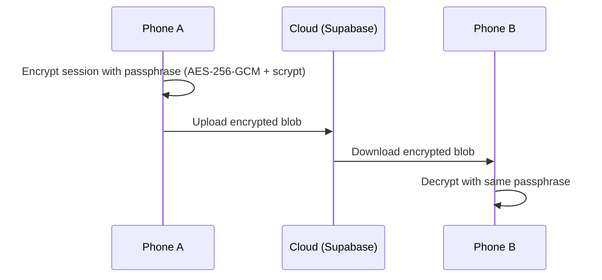

# Cloud Sync

Sync your HRV data across devices with end-to-end encryption. The sync server never sees your plaintext health data.

## How It Works

The HRV Dashboard uses **AES-256-GCM encryption** with a **memory-hard scrypt key derivation function** (N=2¹⁴, r=8, p=1) to encrypt every session before it leaves your device. This is the same protocol used for backups and coach sharing (protocol v4).



**The server stores only encrypted blobs.** Without your passphrase, the data is indistinguishable from random noise.

## Setting Up Sync

1. Open the app and go to **Settings** → **Sync Settings**
2. Enter a **strong passphrase** — this encrypts all data before upload. Choose something memorable but hard to guess. You cannot recover data without this passphrase.
3. Tap **Enable Sync**
4. On your second device, install the app, go to Sync Settings, and enter the **same passphrase**

Sync runs automatically in the background. When conflicts arise (e.g., you edited a session on both devices), the system uses **last-write-wins** resolution based on the `updatedAt` timestamp.

## Encryption Details

| Property | Value |
|----------|-------|
| **Cipher** | AES-256-GCM (authenticated encryption) |
| **Key derivation** | scrypt (N=2¹⁴, r=8, p=1, dkLen=32) |
| **Salt** | Per-blob CSPRNG salt (prevents rainbow tables) |
| **IV** | 12-byte random nonce per encryption |
| **Library** | `@noble/ciphers` (pure JavaScript, audited) |
| **Protocol version** | v4 (v1–v3 blobs still decrypt for backward compatibility) |

## Sync Provider

The default sync provider is **Supabase** (PostgreSQL backend with real-time subscriptions). The sync layer uses a provider interface, so alternative backends can be implemented:

```typescript
interface SyncProvider {
  upload(blob: EncryptedSessionBlob): Promise<void>;
  download(since: string): Promise<EncryptedSessionBlob[]>;
  delete(sessionId: string): Promise<void>;
}
```

## Conflict Resolution

When the same session exists on multiple devices with different data:

1. Both versions are decrypted
2. The version with the later `updatedAt` timestamp wins
3. The losing version is overwritten

This is simple and predictable. If you need to preserve both versions, export to CSV before syncing.

## Security Considerations

- **Passphrase strength matters** — the scrypt KDF makes brute-force expensive, but a weak passphrase (e.g., "password") is still vulnerable
- **No passphrase recovery** — if you forget your passphrase, your synced data cannot be decrypted. Local data on your device is unaffected.
- **Server compromise** — even if the sync server is breached, attackers get only encrypted blobs. Without your passphrase, the data is useless.
- **Transport security** — all network communication uses HTTPS/TLS in addition to the application-layer encryption

## Disabling Sync

Go to **Settings** → **Sync Settings** → **Disable Sync**. This stops uploading new sessions but does not delete data already on the server. Your local data is unaffected.
