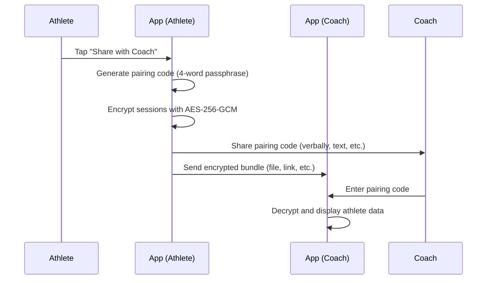

# Coach Sharing

Share your HRV data with a coach or training partner using **encrypted share bundles**. Your data is sealed with a pairing code that you share verbally or via a secure channel — no accounts, no cloud dependency.

## How It Works



## Creating a Share Bundle

1. Open the app → **Share with Coach** screen
2. Select the date range of sessions to share
3. Tap **Generate Share**
4. The app creates:
   - An **encrypted bundle** containing your sessions
   - A **pairing code** — a 4-word passphrase (e.g., `XXXX-alpine-breeze-coral-drift`)

5. Share the bundle file with your coach (AirDrop, email, messaging)
6. Tell your coach the pairing code separately (in person, phone call, secure message)

## Pairing Code Format

Pairing codes use **CSPRNG-derived 4-word passphrases** from a 256-word curated list:

```
XXXX-alpine-breeze-coral-drift
```

This gives ~32 bits of entropy — sufficient for time-boxed shares because:
- Shares expire after **7 days** by default (`DEFAULT_SHARE_TTL_DAYS = 7`)
- The scrypt KDF makes brute-force expensive even for short passphrases
- Each share uses a unique per-bundle salt

## Opening a Share Bundle

1. Receive the encrypted bundle file from the athlete
2. Open the HRV Dashboard app → **Share with Coach** → **Open Share**
3. Select the bundle file
4. Enter the **pairing code** the athlete gave you
5. The app decrypts the sessions and displays the athlete's HRV data

## Security

| Property | Value |
|----------|-------|
| **Encryption** | AES-256-GCM (authenticated encryption) |
| **Key derivation** | scrypt (N=2¹⁴, r=8, p=1, dkLen=32) |
| **Pairing code entropy** | ~32 bits (256⁴ combinations) |
| **Expiry** | 7 days (configurable) |
| **Protocol version** | v4 (same as sync and backup) |

## Coach Web App

For coaches managing multiple athletes, the `apps/coach-web/` directory contains a **Next.js web app** that can open share bundles in a browser. This allows coaches to view athlete data without installing the mobile app.
