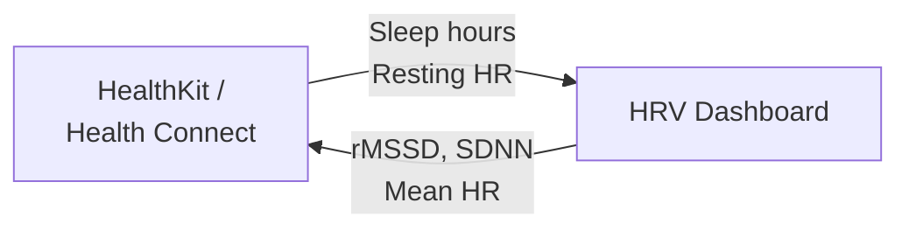

# Health Integrations

The HRV Dashboard integrates with **Apple HealthKit** (iOS) and **Android Health Connect** to sync your HRV data with your device's health ecosystem.

## Two-Way Sync

The integration is **bidirectional**:

- **Pull**: Automatically import sleep data and resting heart rate before your morning reading
- **Push**: Write your HRV metrics back to HealthKit/Health Connect after each recording

## Setting Up

### iOS (HealthKit)

1. Open the app → **Settings** → **Health Integration**
2. Tap **Connect to Apple Health**
3. iOS will show a permission sheet — grant read access to **Sleep Analysis** and **Heart Rate**, and write access to **Heart Rate Variability**
4. Sync starts automatically

### Android (Health Connect)

1. Ensure **Health Connect** is installed from the Play Store
2. Open the app → **Settings** → **Health Integration**
3. Tap **Connect to Health Connect**
4. Grant the requested permissions
5. Sync starts automatically

## Auto-Pull Before Recording

When you start a morning reading with health integration enabled, the app automatically pulls:

- **Sleep hours** from last night's sleep data
- **Resting heart rate** if available from overnight monitoring

This data pre-fills your session context, giving you richer correlations between sleep and HRV without manual entry.

## What Gets Written

After each recording, the app writes to HealthKit/Health Connect:

| Metric | HealthKit Type | Health Connect Type |
|--------|---------------|-------------------|
| rMSSD | `HKQuantityTypeIdentifierHeartRateVariabilitySDNN` | Heart Rate Variability |
| Mean HR | `HKQuantityTypeIdentifierHeartRate` | Heart Rate |

## SDK Loading

The health SDKs are **optional dependencies** loaded at runtime. If the SDK packages aren't installed, the health integration features are simply hidden — the rest of the app works normally.

## Privacy

- Health data is read and written only with your explicit permission
- The app never uploads health data to any server (unless you've enabled E2E encrypted sync)
- You can revoke health permissions at any time from your device's Settings
