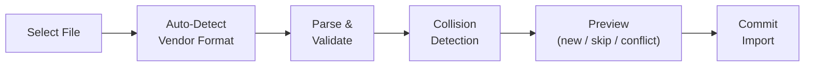

# Importing Data

Migrating from Whoop, Oura, or Garmin? The CSV import wizard lets you bring your existing HRV history into the app so you can start with a pre-computed baseline instead of waiting 5+ days.

## Supported Sources

| Source | Format | Fields Imported |
|--------|--------|----------------|
| **Whoop** | CSV export | Cycle start time, HRV (ms), resting HR, recovery % |
| **Oura** | JSON export | Daily readiness, sleep data, HRV |
| **Garmin** | CSV export | Date, rMSSD, SDNN, average HR |
| **Elite HRV** | CSV | Date, rMSSD, heart rate |
| **HRV4Training** | CSV | Date, rMSSD, heart rate |

## How to Import

### Step 1: Export from your current app

**Whoop**: Open the Whoop app → Menu → Settings → Data Export → Download CSV

**Oura**: Go to [cloud.ouraring.com](https://cloud.ouraring.com) → Settings → Download My Data → JSON

**Garmin**: Go to [connect.garmin.com](https://connect.garmin.com) → Health Stats → HRV → Export CSV

### Step 2: Import into HRV Dashboard

1. Open the app and go to **Settings** → **Import Data**
2. Tap **Select File** and choose your exported CSV or JSON file
3. The wizard identifies the source format automatically
4. A **preview** shows how many sessions will be imported and flags any collisions with existing data

### Step 3: Review and commit

The import wizard uses a two-step flow:

1. **Plan**: Parses the file, detects the source vendor, and checks for duplicates against existing session IDs
2. **Commit**: Imports sessions one by one with per-row error handling — if one row fails, the rest still import



## Baseline Accelerator

After importing, the **baseline accelerator** automatically pre-computes your rolling baseline from the imported data. This means you get verdicts immediately instead of waiting 5+ days for a baseline to build up.

The accelerator:
- Filters to chest-strap recordings only (optical wrist/armband data is excluded for baseline accuracy)
- Takes the first reading per day
- Computes baseline from your configured window (default: 7 days)
- Requires at least 5 distinct days with valid rMSSD data

## Duplicate Handling

Session IDs from imported data use a **deterministic UUID** derived from `${source}:${externalId}`. This means:

- Re-importing the same file won't create duplicates
- The wizard shows a collision count before committing
- You can safely re-import after adding new data to your source app

## Adding a Custom Vendor Parser

The import system uses an open-closed design. To add support for a new vendor:

```typescript
import { registerParser } from '@/integrations/import/vendors';

registerParser('my_device', (content: string) => {
  // Parse CSV/JSON content into ImportedSession[]
  return sessions;
});
```

See [API Reference: CSV Import](../api/integrations.md) for the full parser interface.
