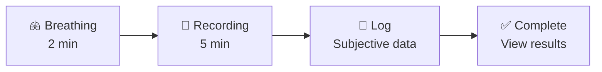

# Morning Protocol

The guided morning protocol orchestrates your entire morning routine into a streamlined 3-phase flow: **breathing → recording → logging**. No more fumbling between screens.

## The Three Phases



### Phase 1: Breathing Exercise (2 minutes)

A guided breathing exercise calms your nervous system before recording. This reduces measurement noise and gives more consistent readings.

- Visual breathing guide with inhale/exhale cycle
- Auto-advances to recording when complete
- Can be skipped in Quick Protocol mode

### Phase 2: Recording (5 minutes)

The app connects to your BLE heart rate monitor and records RR intervals. This is the same recording you'd do from the Reading screen, but integrated into the flow.

- Automatic BLE scan and connection
- Live heart rate and RR interval display
- Countdown timer with progress indicator
- Auto-advances when the timer completes

### Phase 3: Subjective Log

After recording, you're prompted to log context about your morning:

- **Perceived readiness** (1–5 scale)
- **Training type** planned for today
- **Sleep hours** and **sleep quality** (1–5)
- **Stress level** (1–5)
- **Free-text notes**

This phase requires user input — tap **Save** to advance to results.

## Quick Protocol Mode

For experienced users who want to skip the breathing exercise:

- Breathing duration: 0 seconds (skipped)
- Recording duration: 3 minutes (shorter)
- Log: still shown

## Protocol Configuration

```typescript
// Default protocol
{
  breathingDurationSeconds: 120,  // 2 minutes
  recordingDurationSeconds: 300,  // 5 minutes
  showLog: true
}

// Quick protocol
{
  breathingDurationSeconds: 0,    // Skip breathing
  recordingDurationSeconds: 180,  // 3 minutes
  showLog: true
}
```

## Auto-Advance

The protocol automatically advances between phases:

| Phase | Auto-Advance? | Trigger |
|-------|---------------|---------|
| Breathing | ✅ Yes | Timer expires |
| Recording | ✅ Yes | Timer expires or user taps "Finish" |
| Log | ❌ No | User taps "Save" |
| Complete | ❌ No | User navigates away |

## Step Indicator

A visual step indicator at the top of the screen shows your progress through the protocol. Each phase is represented as a dot that fills in as you complete it.
